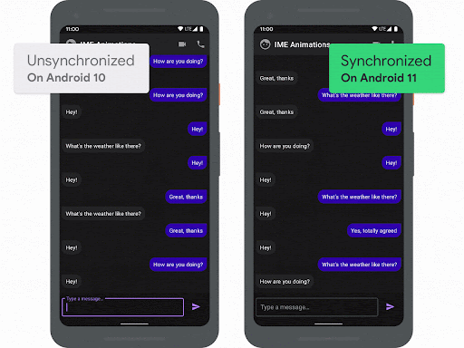

WindowInsetsAnimation sample for [`Mobius Conf`](https://mobiusconf.com/talks/b52ff4ccd2474f1592cfe59a3294b5f6/).
============

This sample shows how to react to the on-screen keyboard (IME) changing visibility and gives some additional helper functions to work with.
To do this, the sample uses the [WindowInsetsAnimationCompat](https://developer.android.com/reference/androidx/core/view/WindowInsetsAnimationCompat) and [WindowInsetsAnimationControllerCompat](https://developer.android.com/reference/androidx/core/view/WindowInsetsAnimationControllerCompat) APIs available in [AndroidX Core](https://developer.android.com/jetpack/androidx/releases/core) and [Android 11](https://developer.android.com/11).

## Features

The app displays a mock instant-message style conversation:

### Reacting to the IME coming on/off screen (API 21+)

When the IME is displayed due to a implicit event (such as the `EditText` being focused), the UI will react as the IME animates in by moving any relevant views in unison. This creates the effect of the IME pushing the app's UI up. You can see this in the demo above on the right. 

In terms of implementation, this is done using a [`WindowInsetsAnimationCompat.Callback`](https://developer.android.com/reference/androidx/core/view/WindowInsetsAnimationCompat.Callback), which allows views to be notified when an insets animation is taking place. 

#### Graceful degredation
As this feature relies on new APIs, it gracefully degrade the experience as so:

 - When running on devices with API level 30+, this feature perfectly tracks the IME as it enter/exits the screens. 
 - When running on devices with API level 21-29, [`WindowInsetsAnimationCompat`](https://developer.android.com/reference/androidx/core/view/WindowInsetsAnimationCompat) will run an animation which attempts to mimic the system IME animation. This will never be able to perfectly track the IME, but should provide a pleasant experience for users.
 - When running devices with API < 21, the animation won't run at all and will revert back to an instant 'snap'.

#### Contact ####

Feel free to get in touch.

    Email:      mig35@mig35.com
    Telegram:   https://t.me/mmig35
    LinkedIn:   https://linkedin.com/in/mig35

#### License ####

    Licensed under the Apache License, Version 2.0 (the "License");
    you may not use this file except in compliance with the License.
    You may obtain a copy of the License at

       http://www.apache.org/licenses/LICENSE-2.0

    Unless required by applicable law or agreed to in writing, software
    distributed under the License is distributed on an "AS IS" BASIS,
    WITHOUT WARRANTIES OR CONDITIONS OF ANY KIND, either express or implied.
    See the License for the specific language governing permissions and
    limitations under the License.
